# 🌿🍁 Crop Disease Detection App (Streamlit) 🌾🍀

## 📌 Overview

This is an **interactive Streamlit web application** that allows users to upload crop images and detect whether the plant is healthy or infected using deep learning models. If infected, the app identifies the disease and suggests remedies. If healthy, it suggests crop type, precautions, and useful fertilizers.


## 🎯 Objective

- Upload a crop image for analysis.
- **Segment** the image to highlight infected areas.
- **Classify** the crop as Healthy or Infected.
- If healthy:
  - Identify crop type.
  - Suggest **precautions** and **fertilizers**.
- If infected:
  - Identify **disease**.
  - Suggest possible **remedies** for the disease.


## 🗂️ Project Structure
```
Crop-Disease-Streamlit/
├── App/
│   ├── classification.py
│   ├── datafetch.py
│   ├── healthy_infected.py
│   ├── main.py                    #  This is your main Streamlit app
│   └── segmentation.py
│
├── Data_Insertion_Code/           # This code was used for data insertion in database
│   ├── healthy_data_insert.py
│   └── Infected_data_insert.py
│
├── JSON_Files/                    # This is the custom database for crop details
│   ├── Healthy_crop.json
│   └── Infected_crop.json
│
├── Models/                        # Deep learning models folder
│
├── output_ss/                     # Screenshots for README or results
│
├── Test Images/                   # Sample test images for the app
│
├── .gitattributes
├── .gitignore
├── README.md
├── requirments.txt        
```


## 🧠 Technologies Used

| Technology  | Purpose                              |
|-------------|--------------------------------------|
| Streamlit   | Frontend UI framework                |
| Python      | Core programming language            |
| PIL (Pillow)| Image file processing                |
| TensorFlow  | (Optional) Deep Learning models      |


## 🚀 How to Run the App

1. Clone the repository

```bash
git clone https://github.com/roysaikat200/crop-disease-streamlit.git
cd crop-disease-streamlit
pip install -r requirements.txt
streamlit run App/main.py
```

## 🖼️ App Features & Workflow
#### 📤 1. Upload Image
User uploads a .jpg, .jpeg, or .png image of a crop leaf.

#### 🧠 2. Segmentation
The uploaded image is passed to `segmentation_app()` which returns:

- Segmented image (highlighting disease)

- Disease percentage (in %)

- Defection ratio (in decimal)

#### 🔍 3. Classification
The image is passed to `classification_app()` which returns:

- `"Healthy"` or `"Infected"`
- If `Healthy`:
    - Crop type is identified via `Healthy()` class.
    - Precautions and fertilizers are listed.

- If `Infected`:
    - Disease name is identified via `Infected()` class.
    - Prevention remedies are listed.


## 🖥️ Output Example
- **Image Details**: Format, Size

- **Segmented Image**: Displayed alongside the original image

- **Classification**: Healthy or Infected

- If **Healthy**:
    - *Crop type* (e.g., Wheat)
    - *Precautions* (bulleted list)
    - *Fertilizers* (bulleted list)

- If **Infected**:
    - *Disease name* (e.g., Apple_Black_Rot)
    - *Prevention remedies* (bulleted list)

<!-- ScreenShots: -->

## App Screenshot - Upload Interface: 

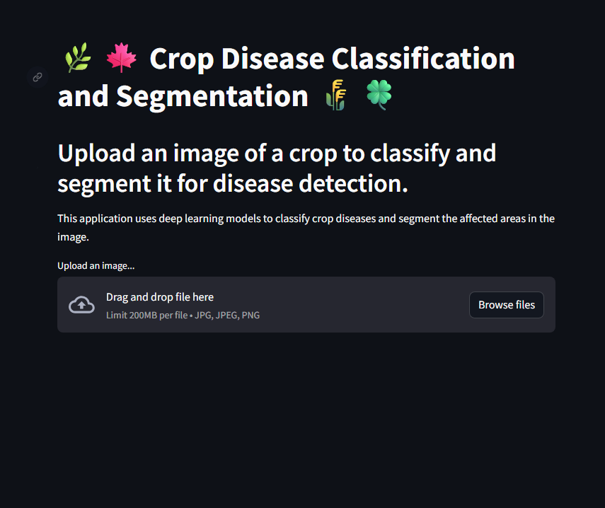

## App Screenshot – Healthy Result: 

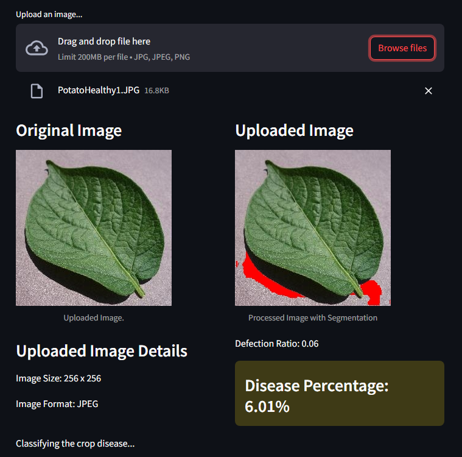
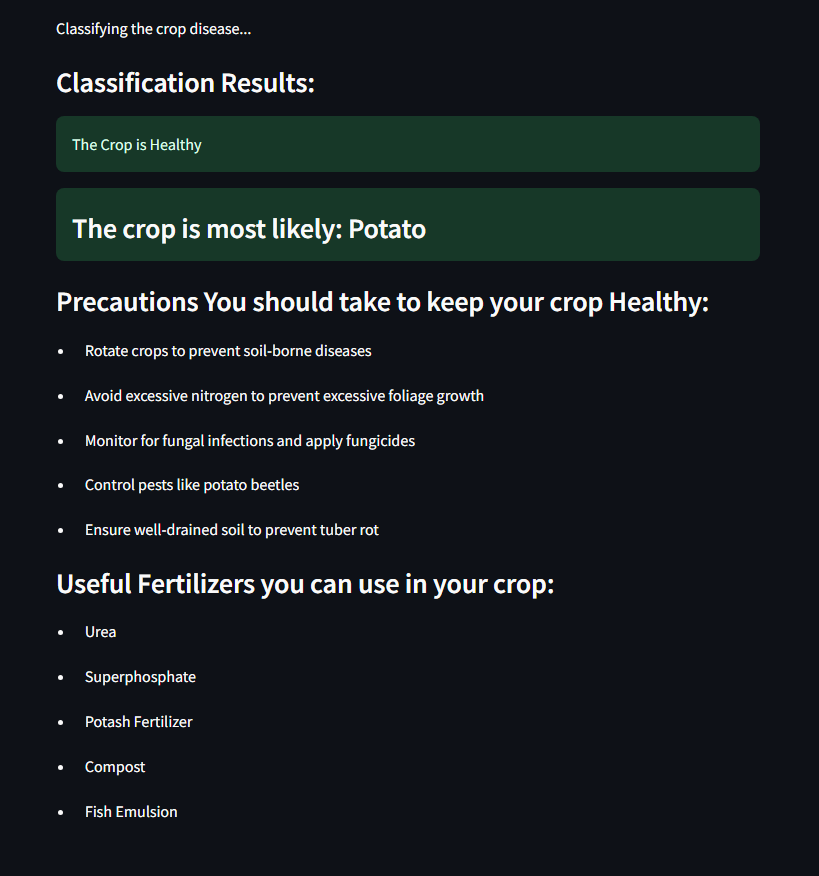

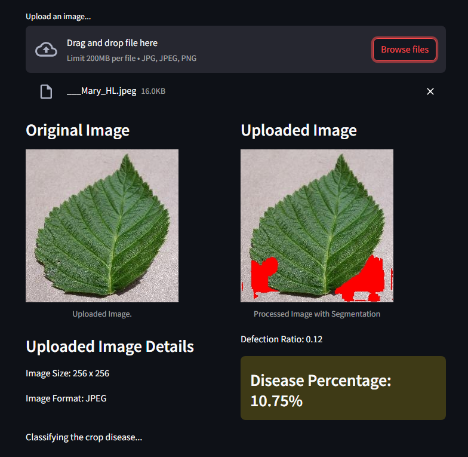

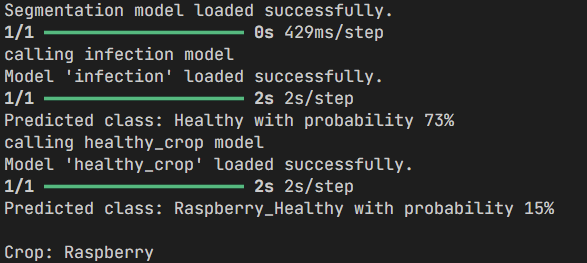

## App Screenshot – Infected Result

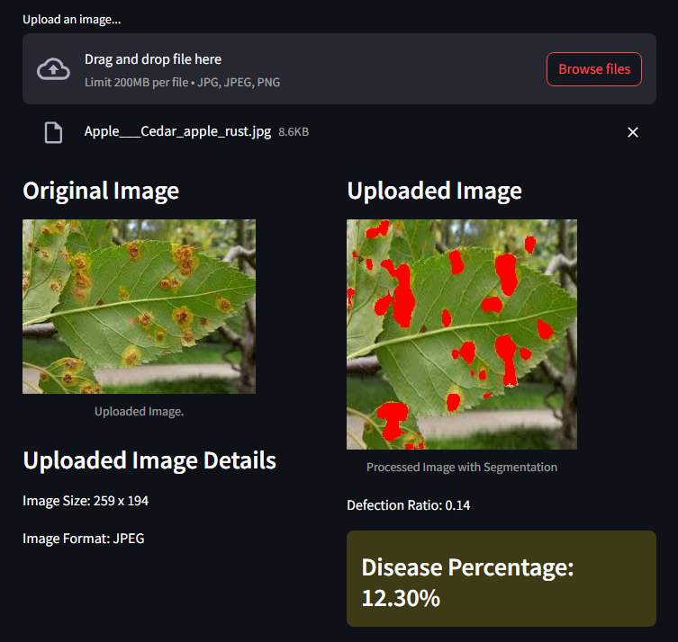
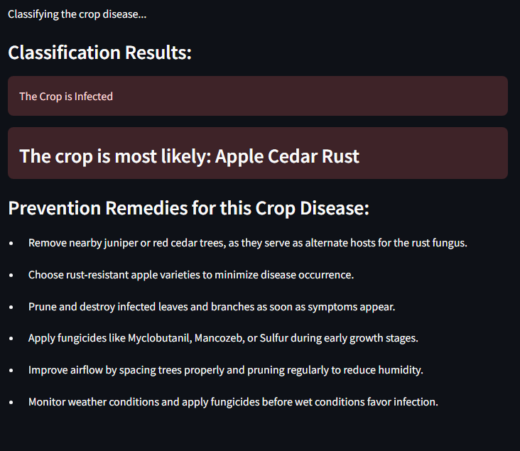
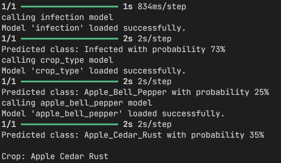
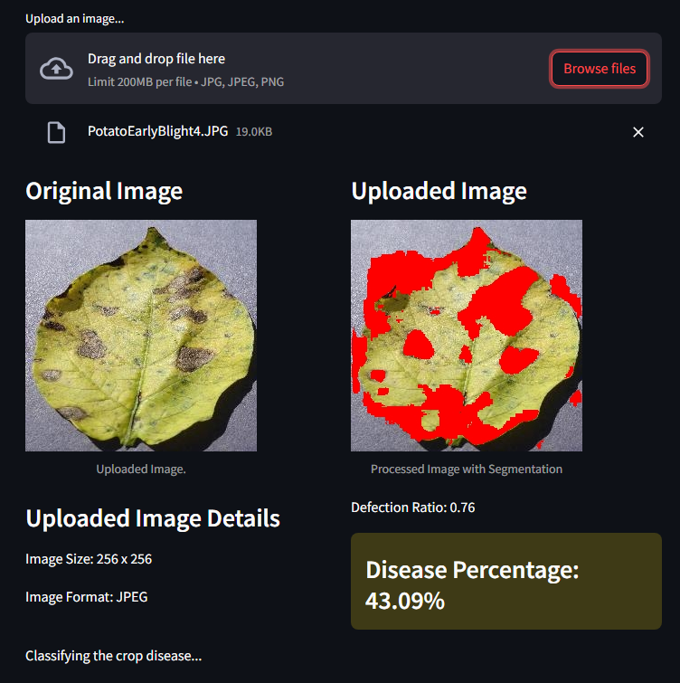
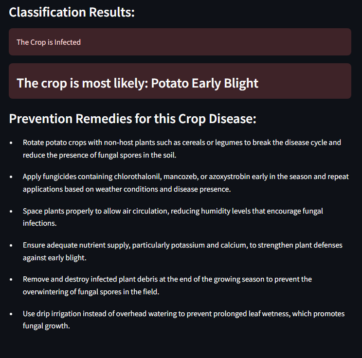
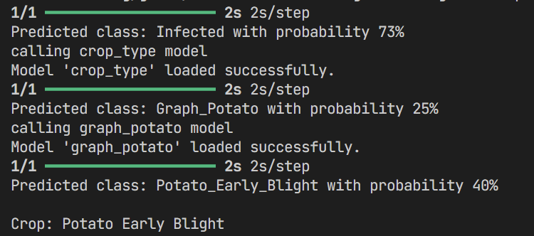
